# OnSpotML System Architecture

```mermaid
graph TB
    %% Data Sources
    subgraph "Data Sources"
        BCN[Barcelona Open Data<br/>- Parking zones<br/>- Traffic data<br/>- POI data]
        TMB[TMB API<br/>- Transport data<br/>- GTFS feeds]
        WEATHER[WeatherAPI<br/>- Historical weather<br/>- Real-time weather]
        EVENTS[Event Data<br/>- Festivals<br/>- Holidays<br/>- Public events]
        OSM[OpenStreetMap<br/>- Road geometries<br/>- Geographic data]
    end

    %% Data Ingestion Layer
    subgraph "Data Ingestion"
        COLLECTOR[BarcelonaDataCollector<br/>- API management<br/>- Rate limiting<br/>- Error handling]
        WEATHER_FETCHER[WeatherDataFetcher]
        EVENT_FETCHER[EventDataFetcher]
    end

    %% Raw Data Storage
    subgraph "Raw Data Storage"
        RAW_PARKING[data/parking/<br/>- Zone definitions<br/>- Occupancy data]
        RAW_WEATHER[data/weather/<br/>- Hourly forecasts<br/>- Historical data]
        RAW_TRANSPORT[data/transport/<br/>- GTFS data<br/>- Stop locations]
        RAW_EVENTS[data/events/<br/>- Event schedules<br/>- Venue locations]
        RAW_AUX[data/auxiliary/<br/>- POI data<br/>- Geographic boundaries]
    end

    %% Data Processing Pipeline
    subgraph "Data Processing"
        VALIDATOR[Data Validation<br/>- Schema validation<br/>- Quality checks<br/>- Consistency checks]
        CLEANER[Data Cleaning<br/>- Outlier removal<br/>- Missing value handling<br/>- Deduplication]
        INTEGRATOR[Data Integration<br/>- Temporal alignment<br/>- Spatial joins<br/>- Cross-source merging]
    end

    %% Feature Engineering
    subgraph "Feature Engineering"
        TEMPORAL[Temporal Features<br/>- Hour/day patterns<br/>- Cyclical encoding<br/>- Holiday detection]
        SPATIAL[Spatial Features<br/>- Geographic clustering<br/>- Distance calculations<br/>- Zone characteristics]
        POI_FEATURES[POI Features<br/>- Nearby amenities<br/>- Business density<br/>- Tourism hotspots]
        WEATHER_FEATURES[Weather Features<br/>- Temperature/precipitation<br/>- Wind/humidity<br/>- Weather conditions]
        TRANSPORT_FEATURES[Transport Features<br/>- Transit accessibility<br/>- Stop proximity<br/>- Route density]
        EVENT_FEATURES[Event Features<br/>- Nearby events<br/>- Event impact radius<br/>- Event categories]
    end

    %% Processed Data
    subgraph "Processed Data"
        FEATURES_DB[(Feature Store<br/>- Engineered features<br/>- Target variables<br/>- Metadata)]
        INTEGRATED_CSV[integrated_parking_data.csv<br/>- Consolidated dataset<br/>- ML-ready format]
    end

    %% Machine Learning Pipeline
    subgraph "ML Pipeline"
        BASELINE[Baseline Models<br/>- Simple heuristics<br/>- Historical averages<br/>- Temporal baselines]
        
        subgraph "Main Models"
            COARSE[Coarse Classifier<br/>- Low/Medium/High<br/>- Occupancy levels]
            FINE[Fine Classifier<br/>- Detailed predictions<br/>- Per-zone specifics]
        end
        
        HIERARCHICAL[Hierarchical Model<br/>- Two-stage prediction<br/>- Coarse → Fine]
        
        HYPEROPT[Hyperparameter Optimization<br/>- Optuna framework<br/>- Cross-validation<br/>- Time series splits]
    end

    %% Model Training & Validation
    subgraph "Training & Validation"
        TSCV[Time Series Cross-Validation<br/>- Temporal splits<br/>- No data leakage<br/>- Forward validation]
        SMOTE_SAMPLING[SMOTE Oversampling<br/>- Class balancing<br/>- Synthetic samples]
        FEATURE_SELECTION[Feature Selection<br/>- Importance ranking<br/>- Correlation analysis<br/>- Leakage detection]
    end

    %% Model Artifacts
    subgraph "Model Artifacts"
        TRAINED_MODELS[(Trained Models<br/>- LightGBM classifiers<br/>- Model weights<br/>- Preprocessing pipelines)]
        MODEL_METADATA[Model Metadata<br/>- Performance metrics<br/>- Feature importance<br/>- Training config]
    end

    %% Evaluation & Monitoring
    subgraph "Evaluation"
        METRICS[Performance Metrics<br/>- Accuracy/F1 score<br/>- Precision/Recall<br/>- Confusion matrices]
        REPORTS[Automated Reports<br/>- Feature importance plots<br/>- Performance dashboards<br/>- Model diagnostics]
    end

    %% Output & Reporting
    subgraph "Reports & Visualizations"
        FIGURES[reports/figures/<br/>- Feature importance<br/>- Confusion matrices<br/>- POI distributions]
        NOTEBOOKS[Analysis Notebooks<br/>- Exploratory analysis<br/>- Model comparisons<br/>- Insights generation]
    end

    %% Data Flow Connections
    BCN --> COLLECTOR
    TMB --> COLLECTOR
    WEATHER --> WEATHER_FETCHER
    EVENTS --> EVENT_FETCHER
    OSM --> COLLECTOR

    COLLECTOR --> RAW_PARKING
    COLLECTOR --> RAW_TRANSPORT
    COLLECTOR --> RAW_AUX
    WEATHER_FETCHER --> RAW_WEATHER
    EVENT_FETCHER --> RAW_EVENTS

    RAW_PARKING --> VALIDATOR
    RAW_WEATHER --> VALIDATOR
    RAW_TRANSPORT --> VALIDATOR
    RAW_EVENTS --> VALIDATOR
    RAW_AUX --> VALIDATOR

    VALIDATOR --> CLEANER
    CLEANER --> INTEGRATOR
    INTEGRATOR --> INTEGRATED_CSV

    INTEGRATED_CSV --> TEMPORAL
    INTEGRATED_CSV --> SPATIAL
    RAW_AUX --> POI_FEATURES
    RAW_WEATHER --> WEATHER_FEATURES
    RAW_TRANSPORT --> TRANSPORT_FEATURES
    RAW_EVENTS --> EVENT_FEATURES

    TEMPORAL --> FEATURES_DB
    SPATIAL --> FEATURES_DB
    POI_FEATURES --> FEATURES_DB
    WEATHER_FEATURES --> FEATURES_DB
    TRANSPORT_FEATURES --> FEATURES_DB
    EVENT_FEATURES --> FEATURES_DB

    FEATURES_DB --> FEATURE_SELECTION
    FEATURE_SELECTION --> TSCV
    TSCV --> SMOTE_SAMPLING
    SMOTE_SAMPLING --> BASELINE
    SMOTE_SAMPLING --> COARSE
    SMOTE_SAMPLING --> FINE
    
    COARSE --> HIERARCHICAL
    FINE --> HIERARCHICAL
    
    BASELINE --> HYPEROPT
    HIERARCHICAL --> HYPEROPT
    
    HYPEROPT --> TRAINED_MODELS
    HYPEROPT --> MODEL_METADATA
    
    TRAINED_MODELS --> METRICS
    MODEL_METADATA --> METRICS
    METRICS --> REPORTS
    REPORTS --> FIGURES
    REPORTS --> NOTEBOOKS

    %% Styling
    classDef dataSource fill:#e1f5fe
    classDef processing fill:#f3e5f5
    classDef storage fill:#e8f5e8
    classDef ml fill:#fff3e0
    classDef output fill:#fce4ec

    class BCN,TMB,WEATHER,EVENTS,OSM dataSource
    class COLLECTOR,WEATHER_FETCHER,EVENT_FETCHER,VALIDATOR,CLEANER,INTEGRATOR processing
    class RAW_PARKING,RAW_WEATHER,RAW_TRANSPORT,RAW_EVENTS,RAW_AUX,FEATURES_DB,INTEGRATED_CSV storage
    class BASELINE,COARSE,FINE,HIERARCHICAL,HYPEROPT,TSCV,SMOTE_SAMPLING,FEATURE_SELECTION,TRAINED_MODELS,MODEL_METADATA ml
    class METRICS,REPORTS,FIGURES,NOTEBOOKS output
```

## System Overview

OnSpotML is a comprehensive machine learning system for predicting parking availability in Barcelona. The system follows a modular architecture with clear separation of concerns:

### Key Components:

1. **Data Ingestion**: Multi-source data collection from Barcelona's open data, transport APIs, weather services, and event platforms
2. **Data Processing**: Robust validation, cleaning, and integration pipeline ensuring data quality
3. **Feature Engineering**: Sophisticated feature creation including temporal, spatial, POI, weather, transport, and event features
4. **ML Pipeline**: Hierarchical classification approach with baseline and advanced models using LightGBM
5. **Validation**: Time series cross-validation with proper temporal splits to prevent data leakage
6. **Reporting**: Comprehensive evaluation metrics and visualization generation

### Data Flow:
- Raw data is collected from multiple external sources
- Data undergoes validation, cleaning, and integration
- Features are engineered from multiple domains
- Models are trained using time series cross-validation
- Results are evaluated and visualized in reports

### Target Variable:
The system predicts parking occupancy levels (Low, Medium, High) with a hierarchical approach that first classifies coarse categories, then fine-tunes predictions. 